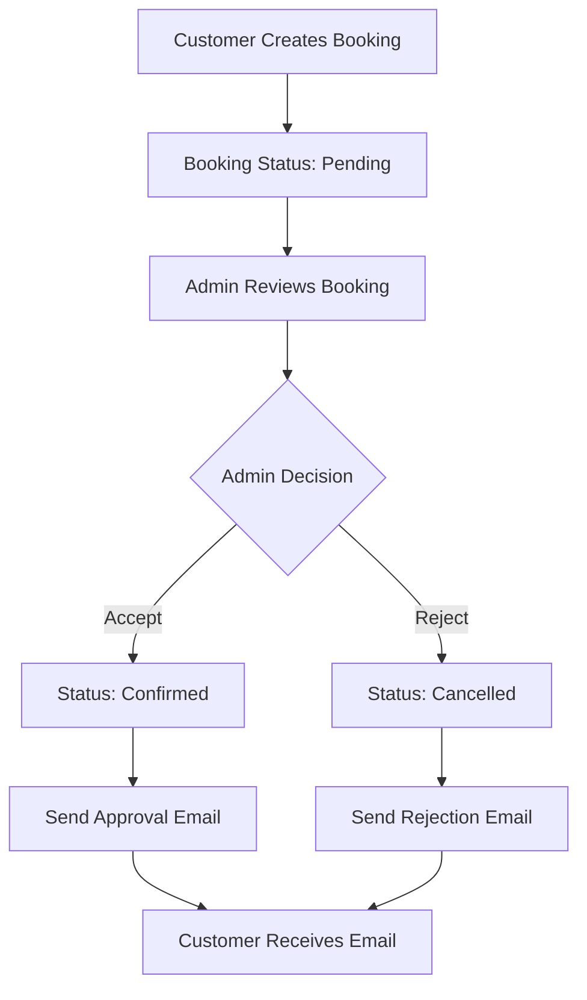

# UphoCare Database Structure & Email Notifications

## Database Overview

UphoCare uses a **shared database** (`db_upholcare`) where both customers and administrators are stored in the same `users` table, differentiated by their `role` field.

## Database Structure

### Core Tables

#### `users` Table

```sql
CREATE TABLE `users` (
  `id` int(11) NOT NULL AUTO_INCREMENT,
  `username` varchar(50) NOT NULL UNIQUE,
  `email` varchar(100) NOT NULL UNIQUE,
  `password` varchar(255) NOT NULL,
  `fullname` varchar(100) NOT NULL,
  `phone` varchar(20) DEFAULT NULL,
  `role` enum('admin','customer') DEFAULT 'customer',
  `status` enum('active','inactive') DEFAULT 'active',
  `created_at` timestamp NOT NULL DEFAULT CURRENT_TIMESTAMP,
  `updated_at` timestamp NOT NULL DEFAULT CURRENT_TIMESTAMP ON UPDATE CURRENT_TIMESTAMP,
  PRIMARY KEY (`id`)
);
```

#### `bookings` Table (Updated)

```sql
CREATE TABLE `bookings` (
  `id` int(11) NOT NULL AUTO_INCREMENT,
  `user_id` int(11) DEFAULT NULL,                    -- References users.id
  `service_id` int(11) DEFAULT NULL,                  -- References services.id
  `booking_number_id` int(11) DEFAULT NULL,            -- References booking_numbers.id
  `booking_date` date DEFAULT NULL,
  `total_amount` decimal(10,2) DEFAULT NULL,
  `status` enum('pending','confirmed','in_progress','completed','cancelled') DEFAULT 'pending',
  `payment_status` enum('unpaid','partial','paid') DEFAULT 'unpaid',
  `notes` text,
  `created_at` timestamp NOT NULL DEFAULT CURRENT_TIMESTAMP,
  `updated_at` timestamp NULL DEFAULT NULL ON UPDATE CURRENT_TIMESTAMP,
  PRIMARY KEY (`id`),
  FOREIGN KEY (`user_id`) REFERENCES `users` (`id`),
  FOREIGN KEY (`service_id`) REFERENCES `services` (`id`),
  FOREIGN KEY (`booking_number_id`) REFERENCES `booking_numbers` (`id`)
);
```

#### `booking_numbers` Table

```sql
CREATE TABLE `booking_numbers` (
  `id` int(11) NOT NULL AUTO_INCREMENT,
  `booking_number` varchar(50) NOT NULL UNIQUE,
  `created_at` timestamp NOT NULL DEFAULT CURRENT_TIMESTAMP,
  PRIMARY KEY (`id`)
);
```

#### `services` Table

```sql
CREATE TABLE `services` (
  `id` int(11) NOT NULL AUTO_INCREMENT,
  `service_name` varchar(100) NOT NULL,
  `service_type` varchar(50) DEFAULT NULL,
  `category_id` int(11) DEFAULT NULL,                -- References service_categories.id
  `description` text,
  `price` decimal(10,2) DEFAULT NULL,
  `status` enum('active','inactive') DEFAULT 'active',
  `created_at` timestamp NOT NULL DEFAULT CURRENT_TIMESTAMP,
  PRIMARY KEY (`id`),
  FOREIGN KEY (`category_id`) REFERENCES `service_categories` (`id`)
);
```

#### `service_categories` Table

```sql
CREATE TABLE `service_categories` (
  `id` int(11) NOT NULL AUTO_INCREMENT,
  `category_name` varchar(100) NOT NULL,
  `description` text,
  `status` enum('active','inactive') DEFAULT 'active',
  `created_at` timestamp NOT NULL DEFAULT CURRENT_TIMESTAMP,
  PRIMARY KEY (`id`)
);
```

## Email Notification System Integration

### How It Works with Shared Database

1. **Customer Creates Reservation:**

   - Customer (role='customer') creates booking
   - Booking stored with `user_id` pointing to customer
   - Status set to 'pending'

2. **Admin Reviews Reservation:**

   - Admin (role='admin') views all bookings
   - System joins `bookings` with `users` to get customer details
   - Admin sees customer name, email, phone from `users` table

3. **Admin Accepts/Rejects:**
   - Admin clicks accept/reject button
   - System updates booking status
   - **Automatic email sent** to customer's email address
   - Email includes customer name and booking details

### Database Queries for Email Notifications

#### Getting Customer Details for Notifications

```sql
SELECT b.*, bn.booking_number, s.service_name, s.service_type, sc.category_name,
       u.fullname as customer_name, u.email as customer_email, u.phone
FROM bookings b
LEFT JOIN booking_numbers bn ON b.booking_number_id = bn.id
LEFT JOIN services s ON b.service_id = s.id
LEFT JOIN service_categories sc ON s.category_id = sc.id
LEFT JOIN users u ON b.user_id = u.id
WHERE b.id = ?
```

This query:

- Gets booking details from `bookings` table
- Joins with `booking_numbers` for booking number
- Joins with `services` for service information
- Joins with `service_categories` for category name
- **Joins with `users` to get customer email and name for notifications**

## Setup Instructions

### 1. Run Database Migration

Execute the migration script to add missing fields:

```bash
# Navigate to database directory
cd database/

# Run migration
php run_migration.php
```

Or manually run the SQL:

```sql
-- Add missing fields to bookings table
ALTER TABLE `bookings`
ADD COLUMN `booking_number_id` INT(11) DEFAULT NULL AFTER `service_id`,
ADD COLUMN `total_amount` DECIMAL(10,2) DEFAULT NULL AFTER `booking_date`,
ADD COLUMN `payment_status` ENUM('unpaid','partial','paid') DEFAULT 'unpaid' AFTER `total_amount`,
ADD COLUMN `updated_at` TIMESTAMP NULL DEFAULT NULL ON UPDATE CURRENT_TIMESTAMP AFTER `created_at`;

-- Create booking_numbers table
CREATE TABLE `booking_numbers` (
  `id` int(11) NOT NULL AUTO_INCREMENT,
  `booking_number` varchar(50) NOT NULL UNIQUE,
  `created_at` timestamp NOT NULL DEFAULT CURRENT_TIMESTAMP,
  PRIMARY KEY (`id`)
);
```

### 2. Configure Email Settings

Edit `config/email.php`:

```php
define('EMAIL_SMTP_HOST', 'smtp.gmail.com');
define('EMAIL_SMTP_USERNAME', 'your-email@gmail.com');
define('EMAIL_SMTP_PASSWORD', 'your-app-password');
define('EMAIL_ENABLED', true);
```

### 3. Test the System

1. **Create Test Users:**

   ```sql
   INSERT INTO `users` (`username`, `email`, `password`, `fullname`, `role`) VALUES
   ('admin', 'admin@uphocare.com', '$2y$10$...', 'Admin User', 'admin'),
   ('customer1', 'customer@example.com', '$2y$10$...', 'John Customer', 'customer');
   ```

2. **Create Test Booking:**

   ```sql
   INSERT INTO `bookings` (`user_id`, `service_id`, `booking_number_id`, `total_amount`, `status`) VALUES
   (2, 1, 1, 150.00, 'pending');
   ```

3. **Test Email Notifications:**
   - Login as admin
   - Go to "All Bookings"
   - Accept/reject the test booking
   - Check customer's email

## User Roles & Permissions

### Customer Role (`role='customer'`)

- Can create bookings
- Can view their own bookings
- Can cancel pending bookings
- Receives email notifications

### Admin Role (`role='admin'`)

- Can view all bookings
- Can accept/reject reservations
- Can manage users
- Can access admin dashboard
- Can manage email notifications

## Email Notification Flow



## Troubleshooting

### Common Issues

1. **"Customer not found" errors:**

   - Check if `user_id` in bookings matches `id` in users table
   - Verify customer has valid email address

2. **Email not sending:**

   - Check email configuration in `config/email.php`
   - Verify SMTP credentials
   - Check email logs in admin panel

3. **Missing booking data:**
   - Run database migration script
   - Check if all required fields exist

### Database Verification Queries

```sql
-- Check if all required fields exist
DESCRIBE bookings;

-- Verify foreign key relationships
SELECT
    b.id, b.user_id, u.fullname, u.email, b.status, b.total_amount
FROM bookings b
LEFT JOIN users u ON b.user_id = u.id
LIMIT 10;

-- Check booking numbers
SELECT * FROM booking_numbers LIMIT 10;
```

## Security Considerations

1. **Role-based Access:** Users can only access data based on their role
2. **Email Validation:** Customer emails are validated before sending notifications
3. **SQL Injection Protection:** All queries use prepared statements
4. **Admin Authentication:** Admin functions require proper authentication

## Future Enhancements

- SMS notifications
- Push notifications
- Email template customization
- Bulk email management
- Advanced reporting
- Customer communication history
