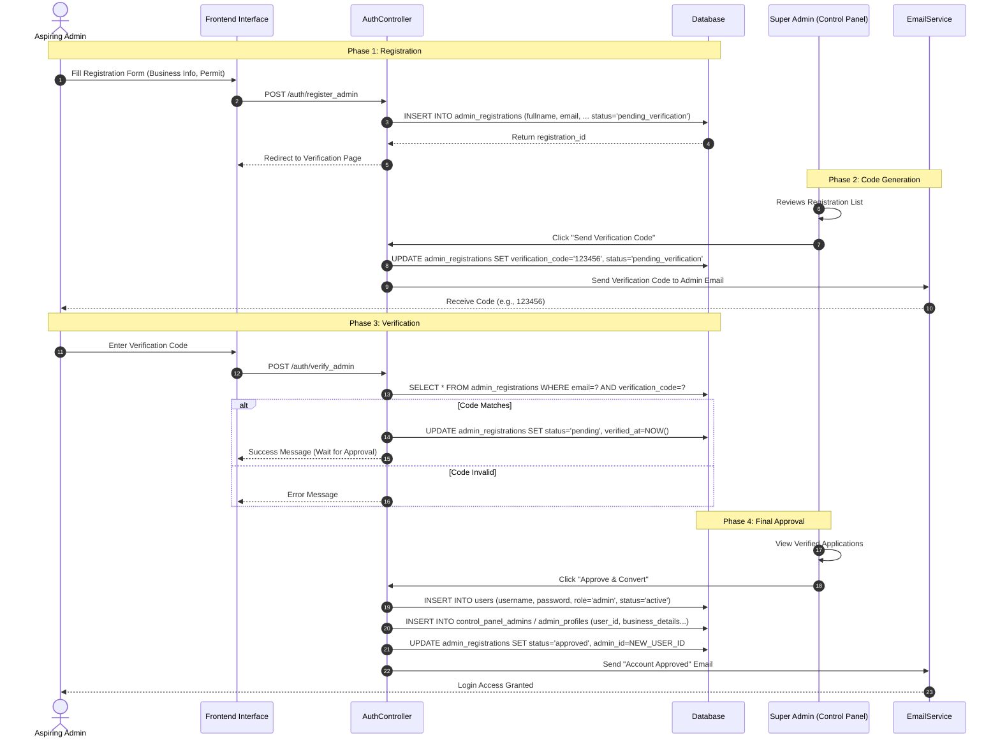
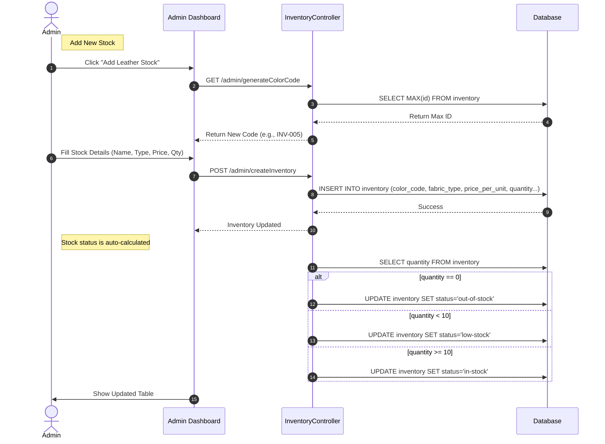

# Admin & Super Admin Sequence Diagrams

This document contains sequence diagrams for workflows specific to the **Admin** and **Super Admin** roles.

## 1. Admin Registration & Verification Workflow

This diagram illustrates the process of a new Admin signing up, being verified by the Super Admin, and finally approved.

**Database Tables Involved:**
- `admin_registrations`: Stores temporary registration data, verification codes, and business permit paths.
- `users`: Final storage for the approved admin account.
- `admin_profiles` / `control_panel_admins`: Stores business details linked to the user.

---

## 2. Inventory Management Workflow (Admin)

This diagram shows how an Admin manages the inventory, specifically adding new stock.

**Database Tables Involved:**
- `inventory`: Stores the items, prices, quantities, and status.
- `store_locations`: (Optional) Links inventory to specific store branches.
