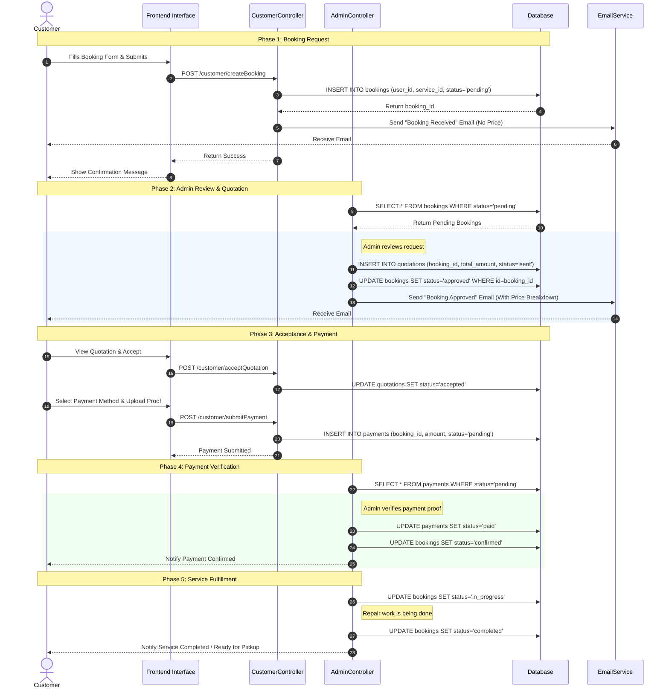

# Sequence Diagram: Customer Booking Process

This sequence diagram illustrates the end-to-end flow of the Customer Booking Process, aligned with the database schema and system documentation.

## Database Interaction Details

The diagram above interacts with the following tables based on the schema:

| Step | Action | Table(s) Affected | Columns |
|------|--------|-------------------|---------|
| 1 | Create Booking | `bookings` | `id`, `user_id`, `service_id`, `status` |
| 2 | Create Quotation | `quotations` | `booking_id`, `total_amount`, `status` |
| 2 | Approve Booking | `bookings` | `status` ('approved') |
| 3 | Accept Quotation | `quotations` | `status` ('accepted') |
| 3 | Submit Payment | `payments` | `booking_id`, `amount`, `payment_status` |
| 4 | Verify Payment | `payments`, `bookings` | `payment_status` ('paid'), `status` ('confirmed') |
| 5 | Update Progress | `bookings` | `status` ('in_progress', 'completed') |
