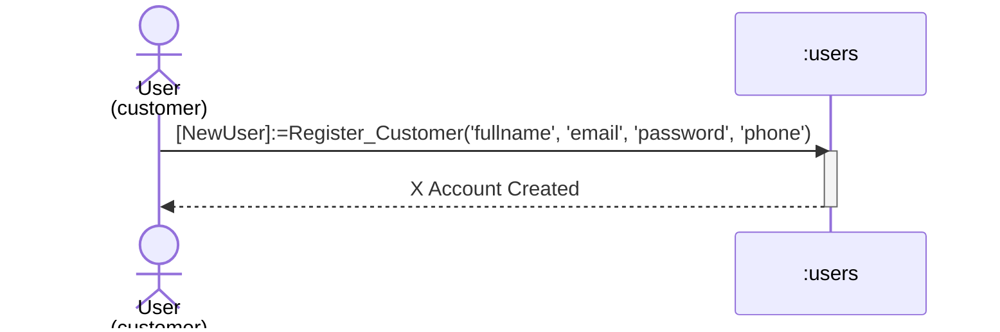
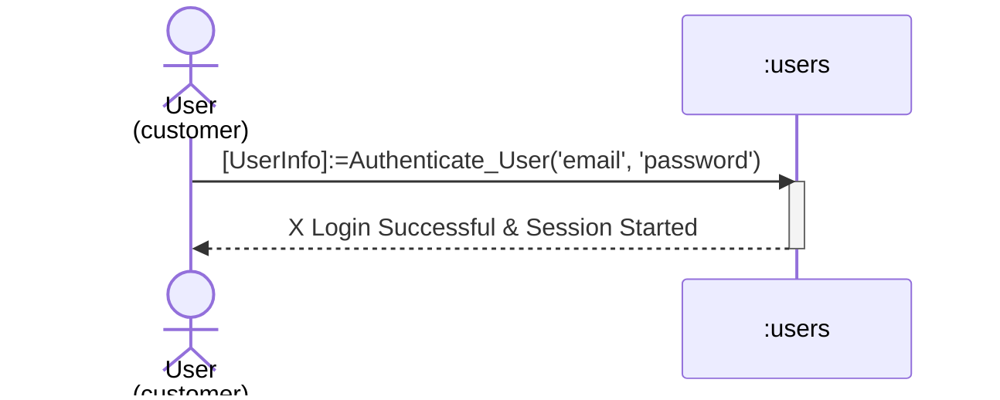
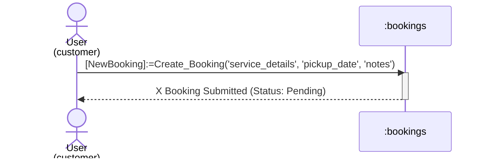
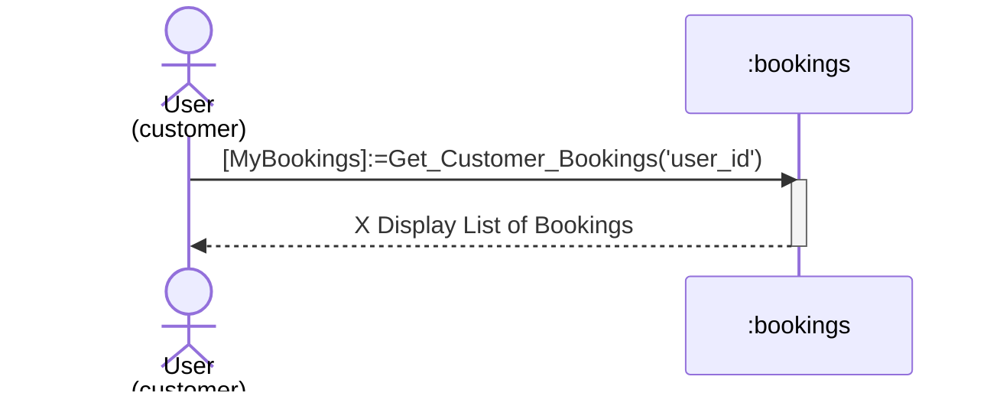
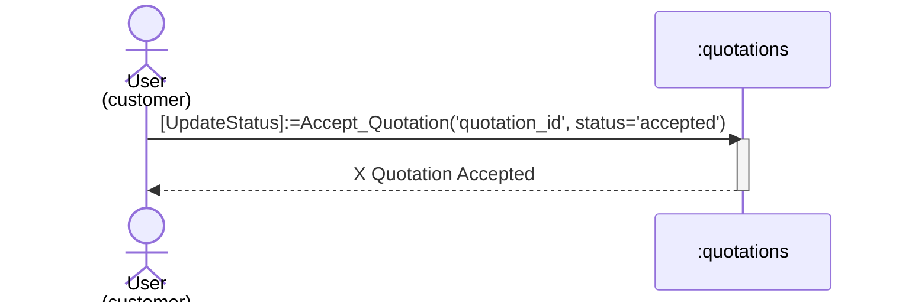

# Customer Process Sequence Diagrams

This document contains sequence diagrams for all **Customer** processes, strictly separating them from other roles.

## 1. Customer Registration
Process of creating a new customer account.

## 2. Customer Login
Process of authenticating into the system.

## 3. Create Repair Reservation (Booking)
Process of submitting a new booking request.

## 4. View Own Bookings
Process of retrieving booking history.

## 5. Accept Quotation
Process of accepting a price quote sent by the admin.

## 6. Submit Payment
Process of uploading payment proof.

