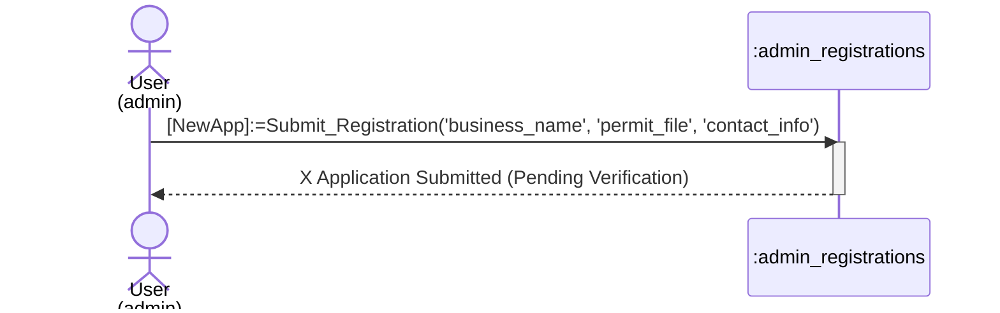
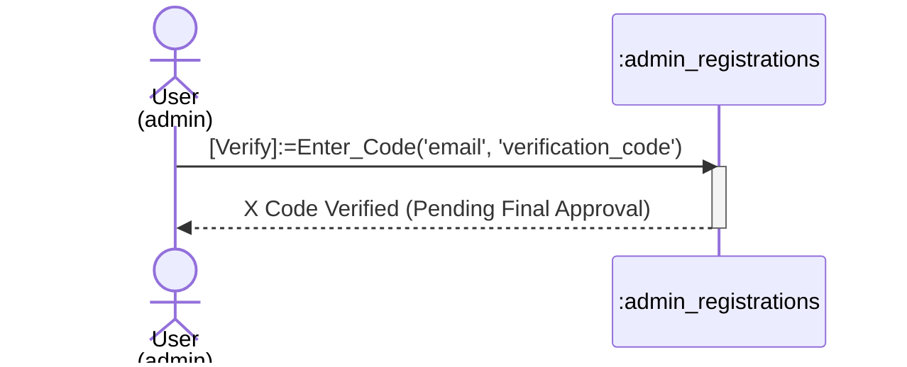
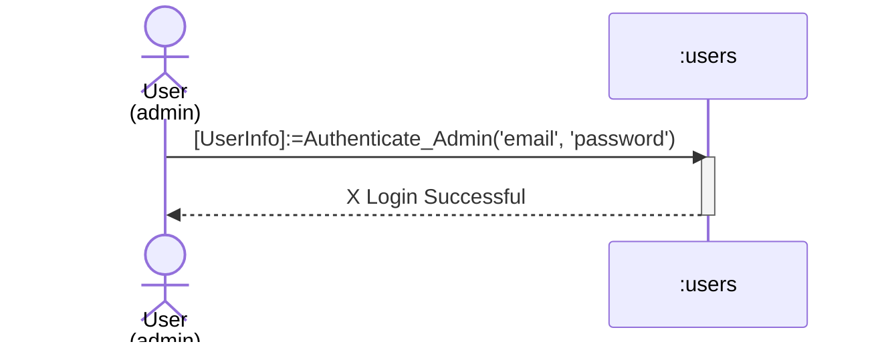
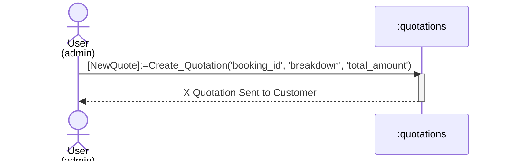
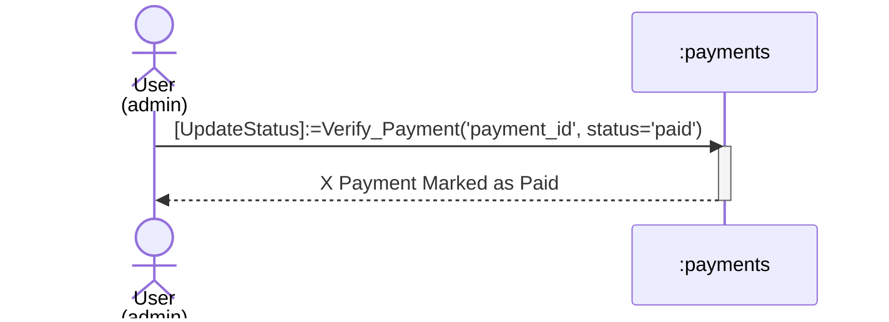
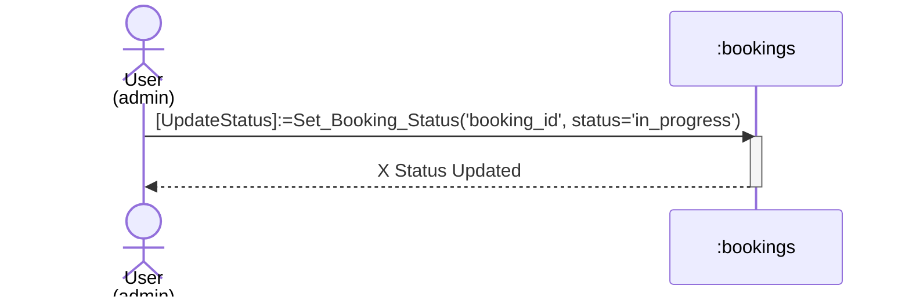
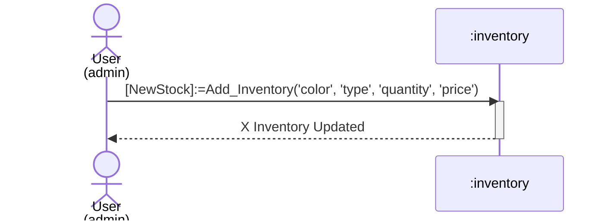
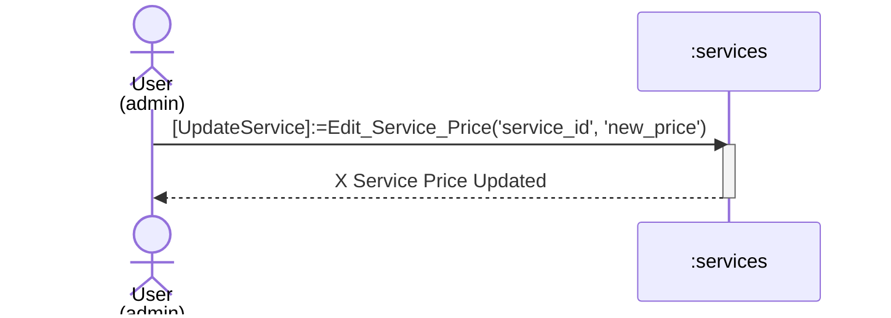

# Admin Process Sequence Diagrams

This document contains sequence diagrams for all **Admin** (Business Owner) processes.

## 1. Admin Registration (Submission)
Process of applying for an admin account.

## 2. Admin Verify Email (Enter Code)
Process of entering the verification code sent by email.

## 3. Admin Login
Process of authenticating into the admin dashboard.

## 4. View Pending Bookings
Process of retrieving new booking requests.

## 5. Send Quotation
Process of creating and sending a price quote.

## 6. Confirm Payment
Process of verifying a customer's payment proof.

## 7. Update Booking Status (Work Progress)
Process of updating the status of a repair (e.g., In Progress, Completed).

## 8. Add Inventory Stock
Process of adding new materials to the inventory.

## 9. Manage Services (Update Price)
Process of updating service details.

