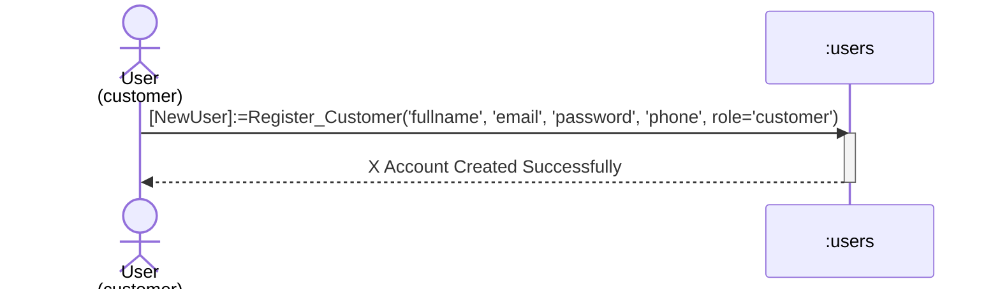
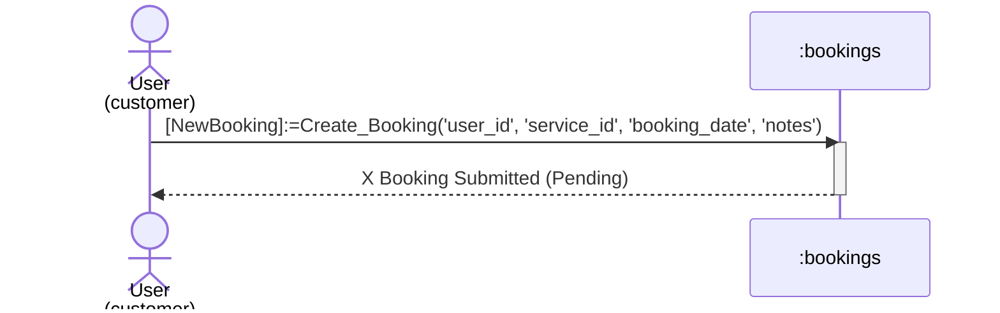
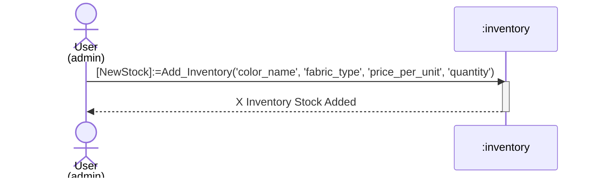
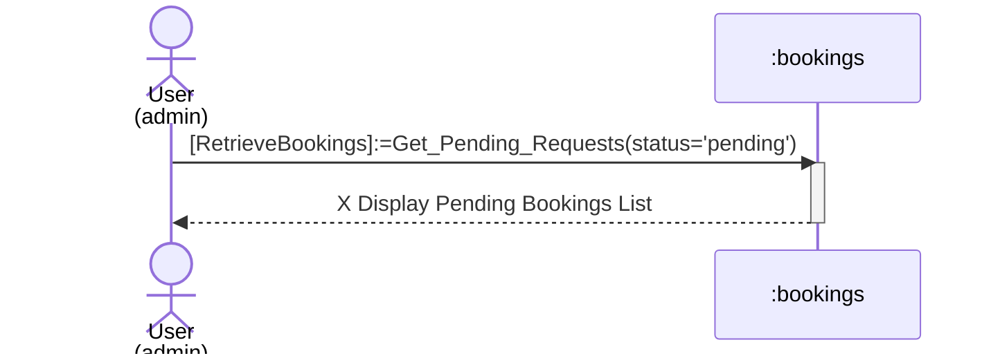
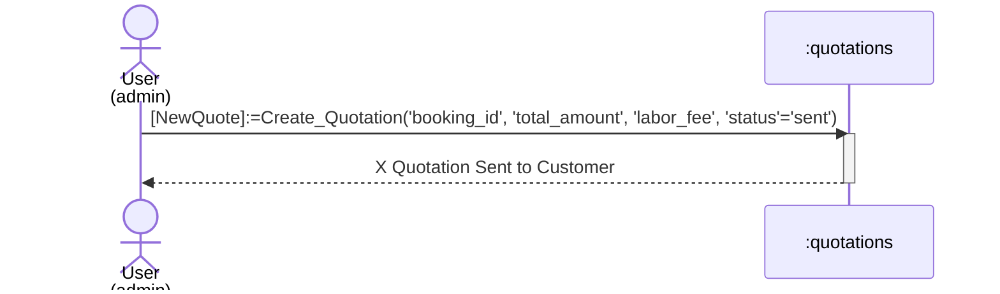
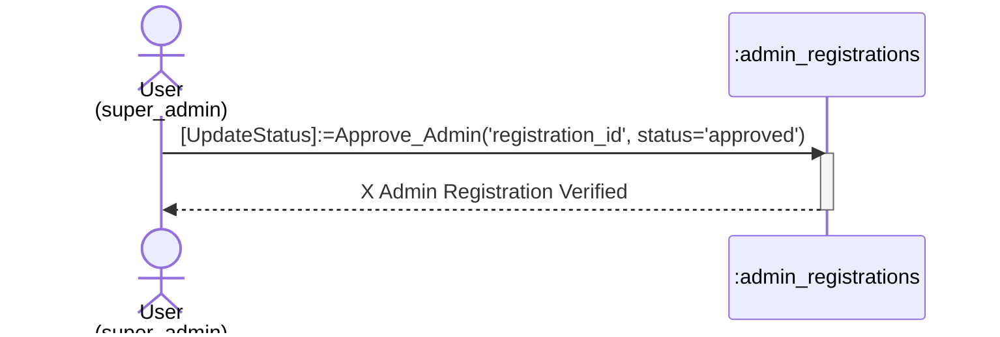
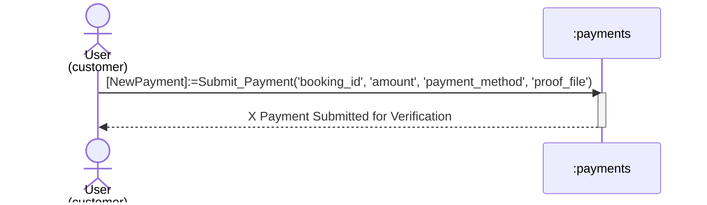

# Detailed System Sequence Diagrams

These sequence diagrams are designed to match the specific visual style of your reference images. They represent individual processes for Customers, Admins, and Super Admins, showing the direct interaction with the database tables.

## 1. Sequence Diagram Involving Customer Registration

This diagram illustrates the process of a new customer adding their details to the system.

## 2. Sequence Diagram Involving Customer Adding New Booking

This diagram shows a customer creating a new repair reservation.

## 3. Sequence Diagram Involving Admin adding New Inventory

This diagram shows an admin adding new leather/fabric stock to the system.

## 4. Sequence Diagram Involving Admin Viewing Pending Bookings

This diagram shows an admin retrieving a list of pending bookings.

## 5. Sequence Diagram Involving Admin Sending Quotation

This diagram shows an admin creating a price quotation for a booking.

## 6. Sequence Diagram Involving Super Admin Approving Registration

This diagram shows the super admin approving a business admin's registration.

## 7. Sequence Diagram Involving Customer Making Payment

This diagram shows a customer submitting a payment record.

