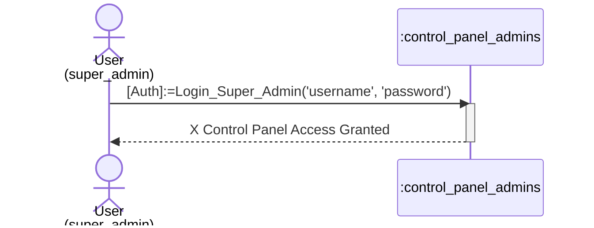
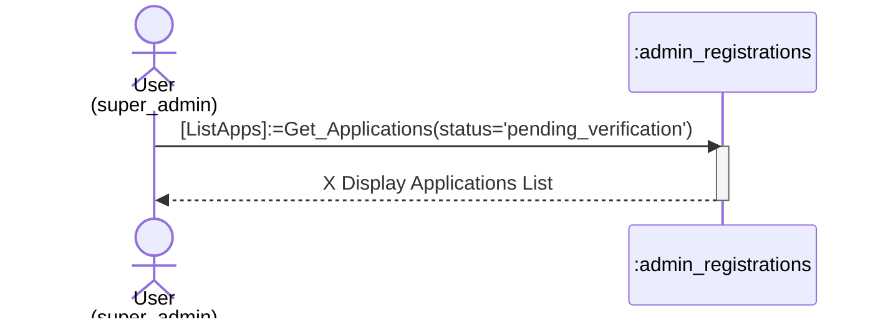
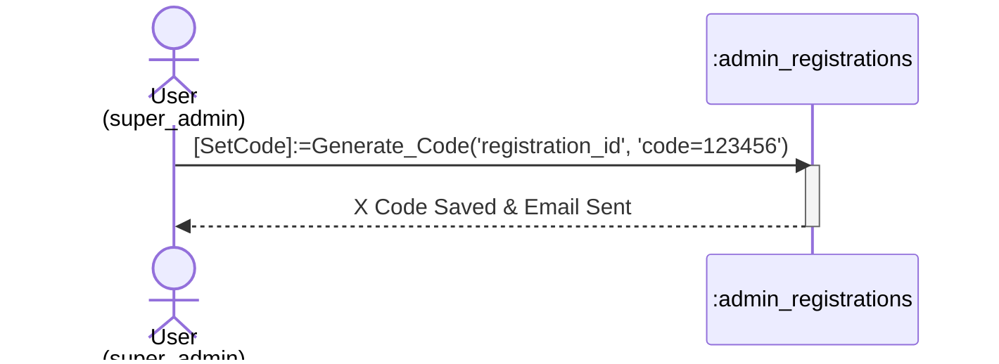
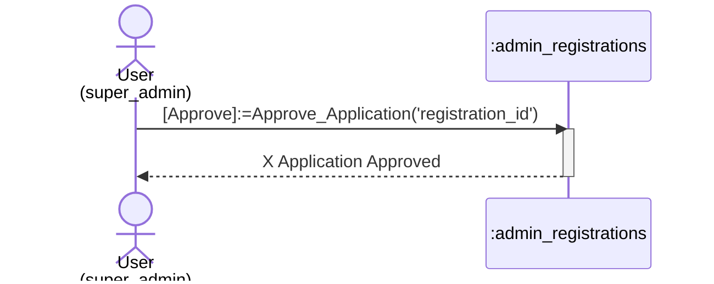
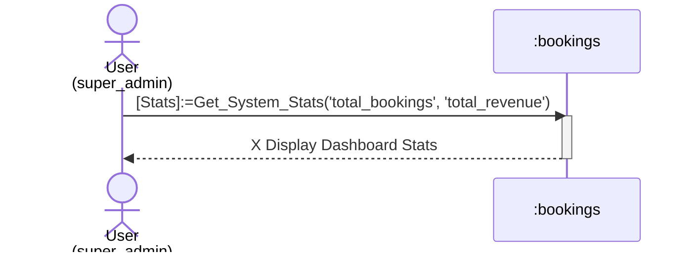

# Super Admin Process Sequence Diagrams

This document contains sequence diagrams for all **Super Admin** processes.

## 1. Super Admin Login
Process of authenticating into the control panel.

## 2. View Admin Applications
Process of viewing the list of pending admin registrations.

## 3. Send Verification Code
Process of generating and storing a verification code for an admin applicant.

## 4. Approve Admin Registration
Process of finalizing the approval of an admin account.

## 5. View System Statistics
Process of gathering system-wide data.

